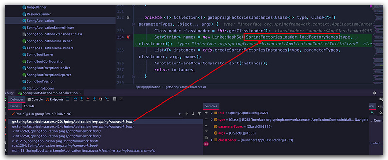
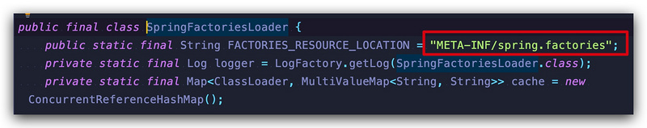

# Study Custom Spring Boot Starter


## 依赖

```xml
<dependency>
    <groupId>org.springframework.boot</groupId>
    <artifactId>spring-boot-configuration-processor</artifactId>
    <optional>true</optional>
</dependency>
```

## 第一步，编写 xxx.factories

在 `resources` 下创建 `META-INF/spring.factories`

原理：





## 第二步，编写 xxxProperties.java

## 第三步，编写 xxxAutoConfiguration.java